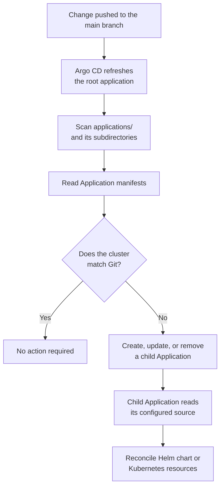

# Applications

This page inventories the applications, controllers, and workloads managed by
the cluster. Complete each entry using the same fields: **Purpose**,
**Namespace**, **Exposure**, **Dependencies**, **Persistent data**, and
**Configuration**.

## GitOps and cluster management

### Root application

The root application is the entry point for the app-of-apps pattern. It watches
the `applications/` directory on the `main` branch and recursively discovers
the Argo CD Application manifests stored there.

When a manifest is added or changed, Argo CD refreshes the root application and
compares the manifests in Git with the child Applications in the cluster. The
root application creates or updates the affected child Application. That child
Application then reconciles its own Helm chart or Kubernetes resources.

Automated pruning and self-healing are enabled. Argo CD therefore corrects
drift from Git and removes child Applications that are removed from the
`applications/` directory. Because the root application uses a resources
finalizer, removing a child Application can also remove the resources managed
by that Application and should be reviewed carefully.

**Namespace:** `argocd`

**Configuration:** [`root-application/root.yaml`](../root-application/root.yaml)

### Argo CD

Argo CD handles the continous delpoyment parts on the server. 

It  treats the git repository as the single source of truth. With auto sync on it will try to sync with the repository. If it detects any difference for example number of replicas between the desired git and the state it will communicate with the kubernetes api to update this in the cluster. 

Some more advatages part with Argo CD is the fact with rollback. If a commit to the repository breaks an application, it can basically just sync the cluster with a previous commit that we know is good.

For rollbacks we need to turn automated sync off.
### Argo CD Image Updater

Argo CD Image Updater monitors the container images used by the Valhall applications. It regularly checks GitHub Container Registry for newer image tags that match the rules configured for each environment.

Production applications only accept tags beginning with prod-, while development applications only accept tags beginning with dev-. The newest-build strategy selects the most recently created matching image. The Image udpater sees if it is either prod- or dev- with a regex.

When a newer image is found, Image Updater changes the image.repository and image.tag fields in the corresponding Helm values file. It uses the Git credentials stored in the argocd/image-updater-git-creds Kubernetes Secret to write the change back to the repository.

For production applications, Image Updater creates a pull request targeting the main branch. The image is deployed after the pull request is reviewed and merged. For development applications, it writes directly to the dev branch, allowing the update to be deployed automatically.

After the Git change is made, Argo CD detects that the application’s desired state has changed. Argo CD then renders the Helm chart with the new image tag and updates the workload in the K3s cluster.

Argo CD Image Updater does not deploy images directly. Its responsibility is to select a suitable image and update the desired state in Git. Argo CD remains responsible for applying that desired state to the cluster.

## Networking and access

### Traefik

_Describe its role as the K3s-provided ingress controller and which routes use
it._

### Cloudflare Tunnel

_Describe the public tunnel, hostname routing, and where traffic is forwarded._

### Kong Gateway

_Describe the public API gateway, its ingress class, database, and private
administrative access._

### Tailscale operator

_Describe private service exposure, operator tags, and which services are
available through the tailnet._

### NGINX test application

_Describe why this workload exists and whether it is still needed._

## Continuous integration

### Actions Runner Controller

_Describe how the controller manages GitHub Actions runner scale sets._

### GitOps runner

_Describe the repository and workflows this runner serves, plus the permissions
it requires._

### Terraform runner

_Describe the infrastructure workflows this runner executes and how state is
accessed._

### Valhall runner

_Describe the build or deployment workflows this runner executes._

## Identity and access management

### Keycloak

_Describe the realms and applications it authenticates, its public route, and
its PostgreSQL dependency._

### Keycloak PostgreSQL

_Describe its storage, credentials reference, and backup requirements._

## Object storage

### MinIO

_Describe the public upload path, private console, stored data, persistent
volume, and backup requirements._

## Observability

### Prometheus

_Describe what it scrapes, how long metrics are retained, and how it is
accessed._

### Node Exporter

_Describe which host metrics it exposes and how Prometheus discovers it._

### Grafana

_Describe its dashboards, Prometheus data source, authentication, and private
access path._

## Valhall

### Frontend

_Describe the frontend's responsibility, public route, backend dependencies,
and container image._

#### Production

_Record the production Application and values file._

#### Development

_Record the development Application and values file._

### Bong API

_Describe the API's responsibility, route, authentication, database dependency,
and container image._

#### Production

_Record the production Application and values file._

#### Development

_Record the development Application and values file._

### Bong PostgreSQL

_Describe the database's consumers, persistent storage, private access, and
backup requirements._

#### Production

_Record the production Application and values file._

#### Development

_Record the development Application and values file._

### Member API

_Describe the API's responsibility, route, Keycloak integration, database
dependency, and container image._

#### Production

_Record the production Application and values file._

#### Development

_Record the development Application and values file._

### Member PostgreSQL

_Describe the database's consumers, persistent storage, private access, and
backup requirements._

#### Production

_Record the production Application and values file._

#### Development

_Record the development Application and values file._

## Adding an application

_Document the checklist for adding a namespace, Argo CD Application, Helm
chart, secrets, ingress, monitoring, persistence, and backup policy._
