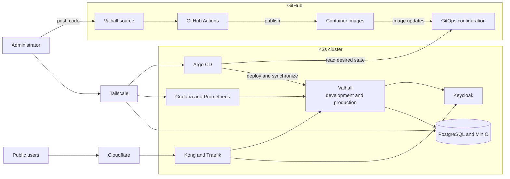
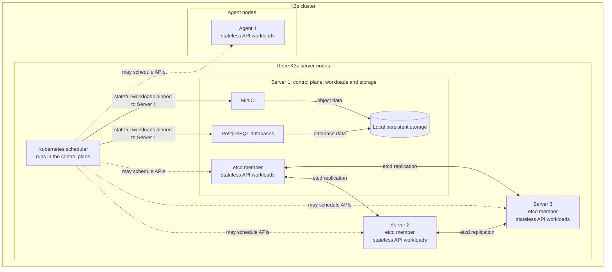
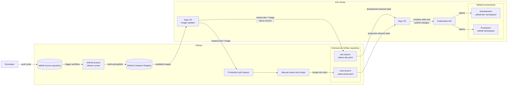
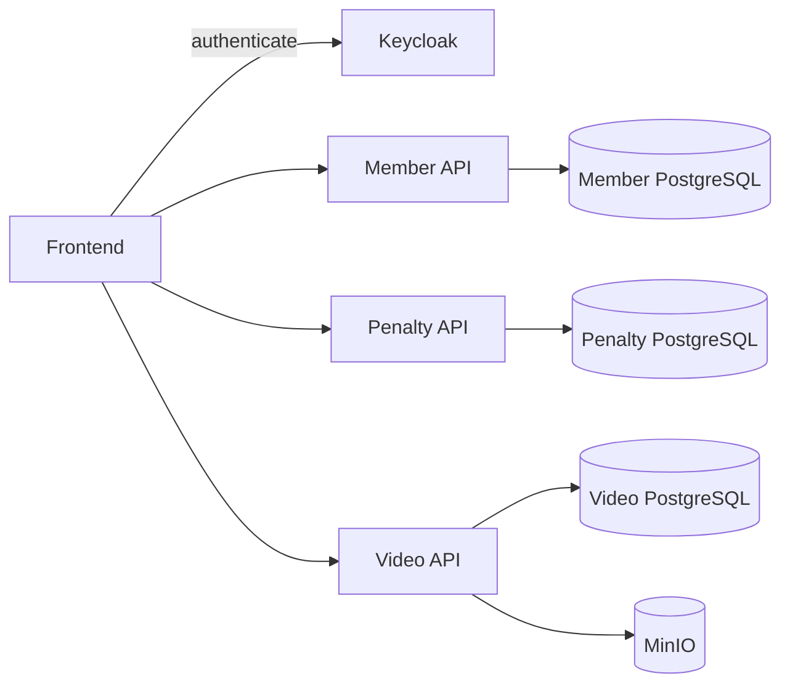

# Architecture

## System overview

### Simplified diagram for system overview

## Cluster architecture

This diagram demonstrates how the clsuter work. We have acontrol plane of 3 nodes. Then I have one worker that's not reliably active. So we need to store replicas on one of the 3 nodes in the control plane aswell.

The storage right now is only on server 1. This have disadvantages and will be updated in teh future with wal and more. I have already started implementing cloudNativePg for this. But right now the stateful workloads need to be on server 1 since it is there where they are stored on the physical disk. the other 2 servers in the control plane can also take stateless API:s. There is a etch replication and snapshot on all. 

## Gitops architecture

This is the architecture for gitops. It is almost fully automated except for the fact that a developer need sto pprove the pull request for pord in homeserver-gitops. 

In Valhall a docker image is automatically build form the dockerfile and then pushed to GHCR. An image updater in argo CD is watching all the GHCR. When one updates with a new tag it will compare it to what it looks for. With regex it determines if the tag is dev or prod. If it is dev it will automatically just update the tag for that service in value-dev opn the dev branch. If it is prod than it will make a PR for it and I need to manually go in and accept it. That is intentional and is for security reasons.

## Valhall architecture

Very simple diagram. If you want to go into it in more details. Go to `https://github.com/Kebertr/valhall`

## Network architecture

## Storage architecture