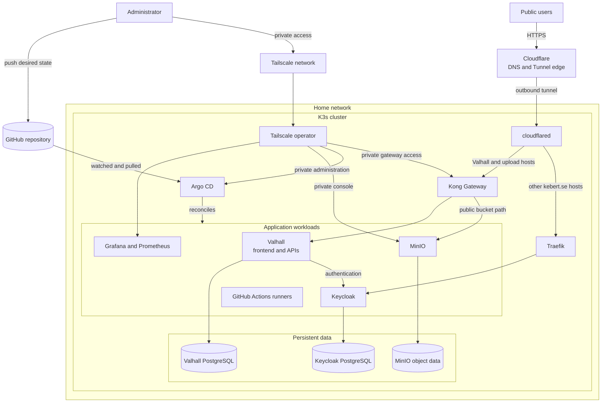

# Architecture

## System overview

The homeserver is a K3s cluster whose desired state is stored in this GitHub
repository. Argo CD continuously reconciles the repository's Argo CD
Applications and Helm charts into the cluster.

Public traffic reaches the cluster through Cloudflare Tunnel. Cloudflared sends
the Valhall and upload hostnames to Kong Gateway and sends the remaining
`*.kebert.se` hostnames to Traefik. Private administrative endpoints are
published through the Tailscale operator instead of Cloudflare.

Arrows show the main control and request paths, not every Kubernetes resource.
All components inside the K3s boundary are deployed as Kubernetes workloads or
controllers. PostgreSQL and MinIO use persistent volumes backed by the
cluster's `local-path` storage class.

## Boundaries and responsibilities

- **GitHub and Argo CD:** GitHub holds the desired state; Argo CD pulls it and
  corrects drift in the cluster.
- **Cloudflare:** Provides the public edge and tunnel. The cluster does not need
  a direct inbound route for the traffic represented here.
- **Kong and Traefik:** Cloudflared selects the internal ingress controller by
  hostname. Each Kubernetes Ingress also declares its owning ingress class.
- **Tailscale:** Provides the private path to operational services and selected
  data endpoints.
- **Persistent data:** Application databases and MinIO data survive workload
  restarts through persistent volume claims. Backup flows are intentionally
  omitted and should be documented separately.

## Scope

This is the high-level map of the system. Detailed diagrams should live with
their relevant documentation: request routing in `networking.md`, GitOps and CI
in `deployment.md`, and persistence and recovery in `storage.md`. The
[application catalogue](applications.md) documents each controller and
workload shown here.
